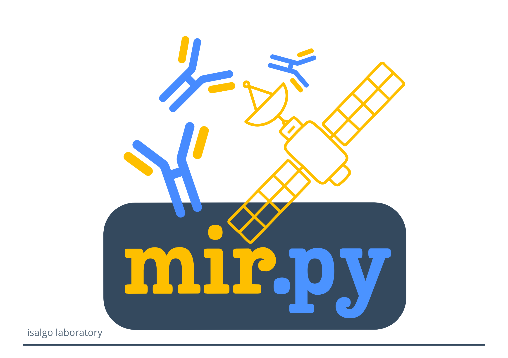
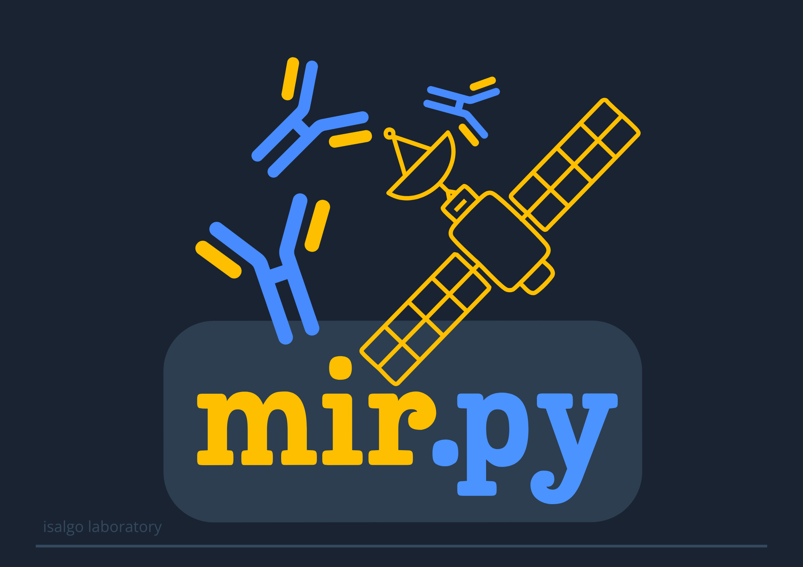
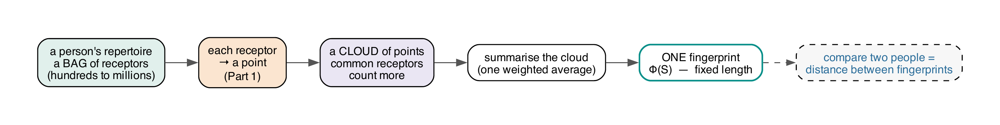

mirpy
=====

ML-oriented embeddings for immune receptor repertoires (TCR/BCR) — the antigenomics group's
machine-learning / embedding library (PyPI ``mirpy-lib``, import ``mir``).

Pure-Python and built on the antigenomics ecosystem
(`seqtree <https://github.com/antigenomics/seqtree>`_,
`vdjtools <https://github.com/antigenomics/vdjtools>`_,
`arda <https://github.com/antigenomics/arda>`_).

mirpy turns receptor sequences into fixed-length vectors at **three scales** — the *clonotype*
(one receptor → a point), the *repertoire* (a whole sample → one fingerprint), and the *cohort*
(many donors → a comparable table) — and gives you the operations to measure across them
(distance, enrichment, MMD), read out what drives a signal, and decode embeddings back to
sequences. The classical v1.x/v2 toolkit is frozen on the ``legacy-v2`` branch (``mirpy-lib`` 2.x).

New here? Start with the :doc:`user guide <usage>` (install → a real result, one task per section),
skim the runnable :doc:`examples <examples>`, and reach for the :doc:`API reference <api>` for
signatures. The mathematical theory (T1–T7) and recorded benchmark numbers live in the companion
`2026-mirpy-analysis <https://github.com/antigenomics>`_ repo (``benchmarks/{THEORY,BENCHMARKS}.md``),
with the LaTeX theory appendix in ``2026-mirpy-ms``.

30-second quickstart
--------------------

.. code-block:: python

   import polars as pl
   from mir.embedding.tcremp import TCREmp

   model = TCREmp.from_defaults("human", "TRB", n_prototypes=1000)
   df = pl.DataFrame({
       "v_call":      ["TRBV10-3*01",   "TRBV20-1*01"],
       "j_call":      ["TRBJ2-7*01",    "TRBJ1-2*01"],
       "junction_aa": ["CASSIRSSYEQYF", "CSARVSGYYGYTF"],
   })
   X = model.embed(df)        # (2, 3K) float32 — distances to 3K prototypes, per V/J/junction

Distance in the prototype-embedding space approximates the pairwise alignment distance (Theory T1);
``TCREmp`` computes the junction part via ``seqtree.gapblock`` and adds baked germline V/J distances.

Or from the shell — ``pip install mirpy-lib`` ships a ``mir`` command:

.. code-block:: bash

   mir embed clonotypes  sample.tsv      -o clonotypes.parquet   # per-clonotype embedding table
   mir embed repertoires cohort/*.tsv.gz -o phi.tsv --mmd mmd.tsv # one Φ(S) per sample, per chain

From a bag of receptors to one comparable fingerprint
-----------------------------------------------------

         summarised into one fixed-length fingerprint Φ(S); two people are compared by the
         distance between their fingerprints.

The sample-level embedding ``Φ(S)`` (``mir.repertoire``) sketches a repertoire as a weighted cloud
of clonotype points — depth-robust down into the RNA-seq regime (Theory T7):

.. code-block:: python

   from mir.repertoire import fit_repertoire_space, sample_embedding, mmd_matrix

   space = fit_repertoire_space(model, pooled_clonotypes)   # ONE basis for the cohort
   embs  = [sample_embedding(space, s) for s in samples]    # Φ(S): mean ‖ diversity ‖ second moment
   D     = mmd_matrix(embs, unbiased=True)                  # pairwise repertoire distance (MMD²)

Capabilities (see the :doc:`API reference <api>`)
-------------------------------------------------

- **Clonotype embedding** — TCREMP prototype embedding (``mir.embedding``) on ``seqtree.gapblock`` +
  baked arda germline distances (``mir.distances``), with PCA denoise and per-chain presets.
- **Density** — graph-free TCRNET/ALICE neighbour enrichment in embedding space, with an
  abundance channel and exact / kdtree / ANN backends (``mir.density``, T6).
- **Repertoire embedding** — one fixed vector per sample: RFF kernel mean, coverage-standardised
  Hill diversity, and a second-moment Fisher block; MMD / HLA-stratified distance and a motif
  witness (``mir.repertoire``, T7).
- **Digital donor / cohort** — fuse per-chain repertoire embeddings into one multi-chain donor
  matrix, hash-verified and serialisable, with batch residualisation and sample clustering
  (``mir.cohort``, T7).
- **Explainable readouts** — name ``Φ``'s channels and ablate them under *your* scorer to see which
  one carries the signal, then hop from the winning kernel-mean channel to the clonotypes driving it
  (``mir.explain`` + scorers in ``mir.bench.eval``, T7).
- **Neural codecs** — forward / inverse / Pgen / unified codecs and a learned repertoire set
  encoder; CUDA → MPS → CPU device selection (``mir.ml``, ``[ml]`` extra).
- **Benchmark harness** — VDJdb clustering + F1/retention and reproduced theory (``mir.bench``).

.. toctree::
   :hidden:

   self
   usage
   examples
   api
