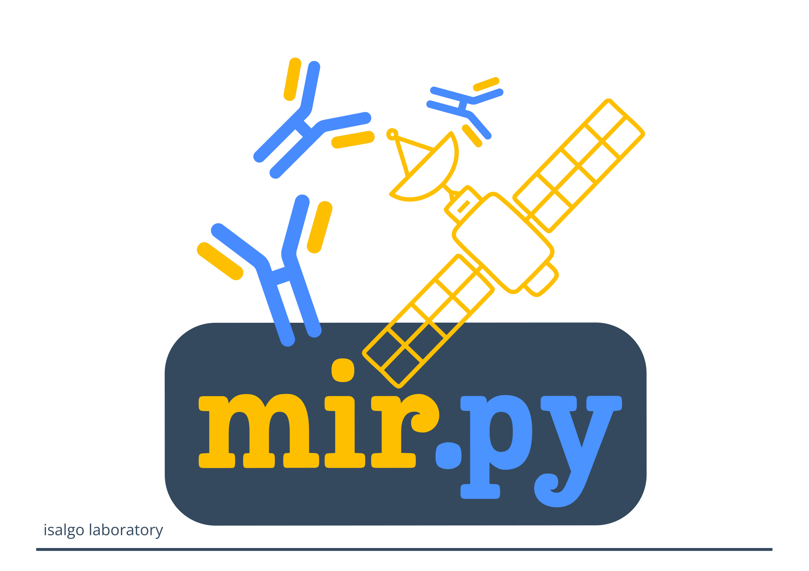
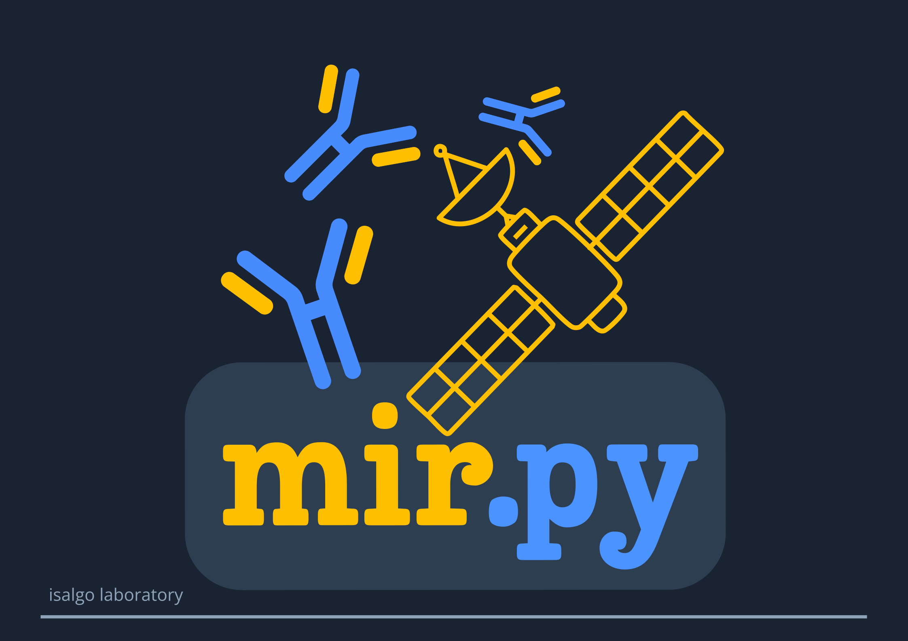
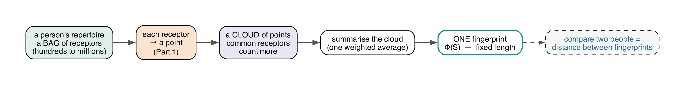

mirpy
=====

.. rst-class:: lead

   Turn T- and B-cell receptor repertoires into fixed-length numeric vectors you can cluster,
   visualise, and hand to a machine-learning model -- at the scale of one receptor, one repertoire,
   or a whole cohort.

mirpy implements **TCREMP**: each receptor is embedded by its alignment distances to a fixed set of
*prototype* sequences, so Euclidean distance in embedding space approximates pairwise alignment
distance. That turns a set of variable-length strings into a coordinate system, which is what every
downstream method actually needs.

PyPI package ``mirpy-lib``, import name ``mir``. Pure Python; the heavy lifting is reused from
`seqtree <https://github.com/antigenomics/seqtree>`_ and
`vdjtools <https://github.com/antigenomics/vdjtools>`_.

.. grid:: 1 2 2 2
   :gutter: 3
   :margin: 4 4 0 0

   .. grid-item-card:: Get started
      :link: getting-started
      :link-type: doc

      Install, embed your first receptors, cluster them, and compare two repertoires. Start here.

   .. grid-item-card:: Guides
      :link: usage
      :link-type: doc

      One page per task: clonotype embedding, density and enrichment, repertoire embedding, the
      digital donor, explainable readouts, neural codecs.

   .. grid-item-card:: Command reference
      :link: cli
      :link-type: doc

      Every command and every flag for the ``mir`` console script.

   .. grid-item-card:: Mathematical foundations
      :link: math
      :link-type: doc

      Why the prototype embedding is a coordinate system, what the repertoire vector knows, and
      what distance between two repertoires means.

Install
-------

.. code-block:: bash

   pip install mirpy-lib

Optional extras, each for one job:

.. code-block:: bash

   pip install "mirpy-lib[ann]"     # pynndescent: approximate neighbours at whole-repertoire scale
   pip install "mirpy-lib[ml]"      # torch: the neural codecs and the learned set encoder
   pip install "mirpy-lib[bench]"   # the benchmark harness and theory experiments

Three scales
------------

The three scales are the organising idea, and choosing the right one is most of the work:

.. list-table::
   :header-rows: 1
   :widths: 16 26 30 28

   * - Scale
     - One unit is
     - You get
     - Module
   * - Clonotype
     - one receptor
     - a point in prototype space
     - :mod:`mir.embedding`
   * - Repertoire
     - one sample from one donor
     - one fingerprint, ``Phi(S)``
     - :mod:`mir.repertoire`
   * - Cohort
     - many donors, several chains each
     - one comparable matrix
     - :mod:`mir.cohort`

Your first embedding
--------------------

.. tab-set::

   .. tab-item:: Python

      .. code-block:: python

         import polars as pl
         from mir.embedding.tcremp import TCREmp

         model = TCREmp.from_defaults("human", "TRB")     # per-chain preset: 2000 prototypes
         df = pl.DataFrame({
             "v_call":      ["TRBV10-3*01",   "TRBV20-1*01"],
             "j_call":      ["TRBJ2-7*01",    "TRBJ1-2*01"],
             "junction_aa": ["CASSIRSSYEQYF", "CSARVSGYYGYTF"],
         })
         X = model.embed(df)        # (2, 6000) float32 -- three distances per prototype

   .. tab-item:: Command line

      .. code-block:: bash

         mir embed clonotypes  sample.tsv      -o clonotypes.parquet --pca 50
         mir embed repertoires cohort/*.tsv.gz -o phi.tsv --mmd mmd.tsv

Each row is the receptor's distance to every prototype, in three blocks -- V, J and junction. The
junction part comes from ``seqtree.gapblock``; the V and J parts are precomputed germline distances.

From a bag of receptors to one fingerprint
-------------------------------------------

         summarised into one fixed-length fingerprint Phi(S); two people are compared by the
         distance between their fingerprints.

A repertoire is an unordered multiset of receptors with clone sizes, so its vector has to be
invariant to order and robust to depth. ``Phi(S)`` sketches it as a weighted cloud of points in three
blocks -- a random-feature kernel mean, a coverage-standardised diversity profile, and a
second-moment block carrying co-occurrence structure:

.. code-block:: python

   from mir.repertoire import fit_repertoire_space, sample_embedding, mmd_matrix

   space = fit_repertoire_space(model, pooled_clonotypes)   # ONE basis for the whole cohort
   embs  = [sample_embedding(space, s) for s in samples]    # Phi(S) per sample
   D     = mmd_matrix(embs, unbiased=True)                  # pairwise repertoire distance

.. important::

   Every sample in a cohort must be embedded through **one** prototype set and **one** basis, or the
   distances are not comparable. ``fit_repertoire_space`` fits that basis once, and every container
   refuses a prototype-hash mismatch rather than silently mixing two coordinate systems. Use
   ``unbiased=True`` whenever samples differ in depth: the biased estimator's self-term inflates
   low-diversity samples and can manufacture a signal.

Choose your path
----------------

.. list-table::
   :header-rows: 1
   :widths: 52 48

   * - You want to
     - Go to
   * - Embed receptors and cluster antigen-specific ones
     - :doc:`getting-started` | :doc:`usage`
   * - Choose a prototype count and a PCA dimension
     - :ref:`presets <which-prototypes>`
   * - Find enriched or antigen-driven neighbourhoods
     - :doc:`usage`
   * - Compare whole repertoires rather than clonotypes
     - :doc:`usage`
   * - Get one fixed, named feature vector per sample
     - :doc:`signature`
   * - Name which part of a vector carries a signal
     - :doc:`channels`
   * - Understand why any of this is valid
     - :doc:`math`
   * - Look up a command or a function
     - :doc:`cli` | :doc:`api`
   * - Check what a term means
     - :doc:`glossary`

What is in the box
------------------

.. list-table::
   :header-rows: 1
   :widths: 22 78

   * - Module
     - What it does
   * - :mod:`mir.embedding`
     - ``TCREmp`` and ``PairedTCREmp``, PCA denoising, the bundled prototypes and per-chain presets
   * - :mod:`mir.distances`
     - Junction distance through ``seqtree.gapblock``, plus precomputed arda germline distances
   * - :mod:`mir.density`
     - Graph-free TCRNET and ALICE neighbourhood enrichment in embedding space, with exact, kdtree
       and approximate backends
   * - :mod:`mir.repertoire`
     - One vector per sample: kernel mean, coverage-standardised Hill diversity, second moment; MMD
       distance, motif witness, and sub-probability measures for incompletely observed samples
   * - :mod:`mir.signature`
     - The portable signature: fixed, named, already-standardised columns that join to vdjtools'
       half on ``sample_id``
   * - :mod:`mir.explain`
     - Which named channel carries a signal under *your* scorer, and which clonotypes drive it
   * - :mod:`mir.cohort`
     - The digital donor: multi-chain donor embeddings, batch residualisation, sample clustering
   * - :mod:`mir.track`
     - Exposure trajectory: a latent progression axis disentangled from a known covariate
   * - :mod:`mir.generate`, :mod:`mir.twin`
     - Sample new synthetic donor states, or perturb and resample one donor's state
   * - :mod:`mir.ml`
     - Neural codecs, learned set encoders and a diffusion generator. Experimental, ``[ml]`` extra
   * - :mod:`mir.bench`
     - VDJdb loader, clustering metrics, cohort scorers, and the reproduced theory experiments

Citing
------

Cite this repository. The theory this implements is collected in :doc:`math`, and the derivations
and recorded benchmark numbers live in the companion analysis repository
``2026-mirpy-analysis`` (``benchmarks/THEORY.md``, ``benchmarks/BENCHMARKS.md``), with the LaTeX
appendix in ``2026-mirpy-ms``.

Licensed GPL-3.0-or-later. The classical v1.x/v2 repertoire toolkit -- parsing, overlap, diversity,
TCRnet, GLIPH -- is frozen on the ``legacy-v2`` branch (``mirpy-lib`` 2.x); its functionality lives
on in `vdjtools <https://github.com/antigenomics/vdjtools>`_ and
`vdjmatch <https://github.com/antigenomics/vdjmatch>`_.

.. toctree::
   :hidden:
   :caption: Getting started
   :maxdepth: 2

   self
   getting-started
   glossary

.. toctree::
   :hidden:
   :caption: Guides
   :maxdepth: 2

   usage
   preprocessing
   signature

.. toctree::
   :hidden:
   :caption: Reference
   :maxdepth: 2

   cli
   api
   channels

.. toctree::
   :hidden:
   :caption: How it works
   :maxdepth: 2

   math

.. toctree::
   :hidden:
   :caption: Worked examples
   :maxdepth: 2

   examples
   notebooks
