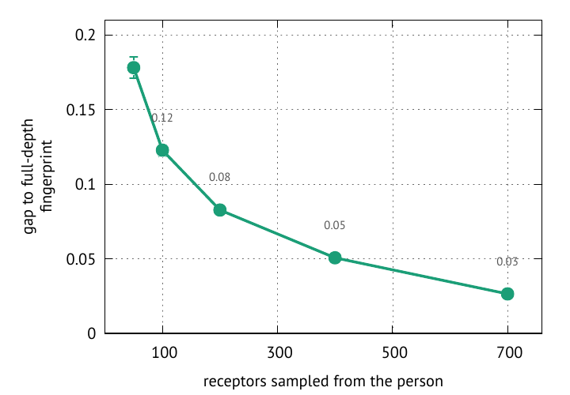

User guide
==========

One task per section, cheapest-to-run first. Every embedding operates on ``polars`` frames keyed by
the AIRR column names ``v_call`` / ``j_call`` / ``junction_aa`` (and ``duplicate_count`` for clone
sizes). Sections build on each other but each is self-contained.

Install & the data model
-------------------------

.. code-block:: bash

   pip install mirpy-lib            # core: import mir, and the `mir` CLI
   pip install "mirpy-lib[bench]"   # + benchmark harness (matplotlib, huggingface_hub, lifelines)
   pip install "mirpy-lib[ann]"     # + approximate-NN density backend (pynndescent)
   pip install "mirpy-lib[ml]"      # + neural codecs (torch)
   pip install "mirpy-lib[examples]"# + marimo notebooks (marimo, matplotlib, umap-learn)

Requires ``vdjtools>=3.0.0`` and ``seqtree>=0.3.0``; ``mir`` itself is a pure-Python
``py3-none-any`` wheel. A clonotype table is a polars frame; clone sizes live in
``duplicate_count`` (repertoire-level embeddings weight by them):

.. code-block:: python

   import polars as pl

   sample = pl.DataFrame({
       "v_call":          ["TRBV10-3*01",   "TRBV20-1*01",   "TRBV28*01"],
       "j_call":          ["TRBJ2-7*01",    "TRBJ1-2*01",    "TRBJ2-1*01"],
       "junction_aa":     ["CASSIRSSYEQYF", "CSARVSGYYGYTF", "CASSLGQAYEQFF"],
       "duplicate_count": [120,             40,              12],
   })

To read a file in any format instead, use ``vdjtools.io.read`` (AIRR TSV, vdjtools, MiXCR,
immunoSEQ, parquet — the format is sniffed): ``sample = vdjtools.io.read("sample.tsv")``.

Clonotype embedding
-------------------

``TCREmp`` maps each clonotype to a fixed vector — the concatenation of its distances to a set of
prototype clonotypes, per component (V, J, junction). Distance in this space approximates the
pairwise alignment distance (Theory T1).

.. code-block:: python

   from mir.embedding.tcremp import TCREmp

   model = TCREmp.from_defaults("human", "TRB", n_prototypes=1000)
   X = model.embed(sample)                  # (3, 3K) float32, interleaved [v, j, junction]

   # paired chains: a dict of per-locus frames -> concatenated embedding
   from mir.embedding.tcremp import PairedTCREmp
   paired = PairedTCREmp.from_defaults("human", ("TRA", "TRB"))
   Xp = paired.embed({"TRA": tra_df, "TRB": trb_df})

Pick prototype counts / PCA dims from the per-chain presets, and denoise with PCA:

.. code-block:: python

   from mir.embedding.presets import get_preset
   from mir.embedding.pca import pca_denoise

   preset = get_preset("human", "TRB")      # n_prototypes, n_components (95% var), recon dims
   Xd = pca_denoise(X, n_components=preset.n_components)

**From the shell** — the ``mir embed clonotypes`` command does exactly this on a file:

.. code-block:: bash

   mir embed clonotypes sample.tsv --pca 50 -o clonotypes.parquet
   #   input:  any format vdjtools.io reads; locus inferred (or pass --locus)
   #   output: one row per clonotype (id columns + e0…), TSV or (recommended for the wide raw
   #           embedding) Parquet.  --n-prototypes / --mode / --pca / --threads for the knobs.

Clustering antigen-specific TCRs
--------------------------------

Antigen-specific receptors form tight clusters in the embedding. ``mir.bench`` clusters them and
scores per-antigen F1 / retention against known labels (e.g. a VDJdb dump):

.. code-block:: python

   from mir.bench.metrics import cluster, cluster_metrics

   labels = cluster(pca_denoise(X, n_components=50), method="dbscan")   # or "hdbscan" / "optics"
   # with epitope labels aligned to the rows:
   metrics = cluster_metrics(labels, epitopes)                         # {epitope: AntigenMetric}

DBSCAN (default) is tightest/purest; HDBSCAN trades precision for ~3× coverage on variable-density
data. See ``notebooks/quickstart.py`` for the end-to-end VDJdb example with a UMAP.

Density and background subtraction
----------------------------------

``mir.density`` finds antigen-driven convergent clusters by neighbour enrichment in the embedding
space (graph-free TCRNET/ALICE, Theory T6): ``E(z) = f_obs(z) / f_gen(z)`` estimated by an
adaptive-bandwidth balloon estimator with a Poisson/binomial test and BH q-values.

.. code-block:: python

   from mir.density import fit_density_space, neighbor_enrichment, enriched_mask, denoise_and_cluster

   # background = a biological control (TCRNET) or generate_background(...) (ALICE, P_gen)
   space, obs_emb, bg_emb = fit_density_space(model, obs_df, control_df, n_components=20)
   res  = neighbor_enrichment(obs_emb, bg_emb, test="binomial")   # backend="kdtree" for multicore
   hits = obs_df.filter(enriched_mask(res, alpha=0.05))           # background-subtracted clones
   labels, mask = denoise_and_cluster(obs_emb, res)               # noise-filter + cluster the hits

Prefer a biological control (e.g. pre/post-vaccination) over the P_gen background — differential
enrichment cancels generic public convergence and isolates the antigen-specific response. At
whole-repertoire scale, pass ``backend="kdtree"`` (exact, multicore) or ``backend="ann"``
(approximate, ``[ann]`` extra). See ``notebooks/density.py``.

Repertoire embedding Φ(S) + MMD
-------------------------------

``mir.repertoire`` embeds a whole repertoire — an order-invariant multiset of clonotypes with clone
sizes — into one fixed vector ``Φ(S)`` (kernel mean ‖ Hill diversity ‖ second moment), depth-robust
into the RNA-seq regime (Theory T7). Every sample in a cohort must share **one** basis, fit once:

.. code-block:: python

   from mir.repertoire import (fit_repertoire_space, sample_embedding,
                               mmd_matrix, hla_stratified_mmd, class_witness)
   import polars as pl

   space = fit_repertoire_space(model, pl.concat(samples))    # ONE basis for the cohort
   embs  = [sample_embedding(space, s) for s in samples]      # Φ(S); each .vector is the tensor
   D     = mmd_matrix(embs, unbiased=True)                    # pairwise MMD (unbiased when depth varies)

   # supervised motif finder: public clones separating two groups
   motifs = class_witness(space, pos_samples, neg_samples, candidates)

Read only a few hundred receptors and Φ is already close to the full-depth fingerprint — the
gap shrinks as ``n_eff^{-1/2}`` (Theory ``prop:kme``):

         ~0.18 at n=50 to ~0.03 at n=700 (real mir measurement, human TRB).

Use ``unbiased=True`` whenever samples differ in depth/diversity — the biased V-statistic's
``1/n_eff`` self-term otherwise inflates low-diversity samples and fakes a signal. For a
batch-confounded contrast, compare *within-batch* (residualise ``Φ`` on the batch indicator, see the
cohort section): a batch offset is first-order and cancels, while a batch-orthogonal signal (e.g.
HLA) survives.

**From the shell** — ``mir embed repertoires`` fits one shared basis per chain and writes the Φ table:

.. code-block:: bash

   mir embed repertoires cohort/*.tsv.gz -o phi.tsv --mmd mmd.tsv
   #   one input file per repertoire (sample id = filename stem); one output row per sample per
   #   chain (sample_id, locus, n_clonotypes, phi0…). --blocks mean,diversity[,second] and
   #   --weight / --n-rff pick the Φ layout;  --mmd also writes the pairwise unbiased-MMD matrix.

Multi-chain digital donor (``mir.cohort``)
------------------------------------------

``mir.cohort`` fuses per-chain repertoire embeddings into one **digital donor** matrix — an
identity (kernel-mean) block plus diversity and coverage channels, per locus, merged by name. The
result is hash-verified (the prototypes *and* the fitted PCA must match) and serialisable, so a
held-out donor is projected through the same basis:

.. code-block:: python

   from mir.repertoire import fit_repertoire_spaces, correct_batch
   from mir.cohort import fit_donor_embeddings, residualize, cluster_samples

   spaces = fit_repertoire_spaces(models, cohort_frames)        # one RepertoireSpace per locus
   cohort = fit_donor_embeddings(spaces, donor_frames)          # DonorCohort{X, spec, ...}
   cohort.save("cohort.npz")                                    # carries every locus' prototype hash

   Xc  = residualize(cohort.X, batch)                           # first-order: subtract each batch mean
   Xc  = correct_batch(cohort.X, batch)                         # Harmony-like cluster-aware, when the
                                                                # batch is confounded with biology (T7 prop:batch)
   lab = cluster_samples(embs, unbiased=True)                   # MMD-cluster repertoires into states

``residualize`` removes a *global* batch offset; ``correct_batch`` removes it **per soft cluster**
(reducing to ``residualize`` at ``n_clusters=1``), so a batch confounded with a biological cluster is
corrected without erasing that biology.

Explainable channel readout (``mir.explain``)
---------------------------------------------

``Φ.vector`` is an anonymous concatenation, so "the classifier found something" has no noun.
``mir.explain`` attaches the names and asks which of them carries the signal. The scorer is yours —
the library never sees the labels, so the same call serves a cross-validated AUC or a Cox C-index
(scorers live in :mod:`mir.bench.eval`):

.. code-block:: python

   from mir.explain import stack_embeddings, channel_report
   from mir.bench.eval import cv_auc

   X, spec = stack_embeddings(embs)                     # X[i] is exactly embs[i].vector; names attached
   rep = channel_report(X, spec, lambda B: cv_auc(B, y)[0], base=0.5)
   rep.best                                             # -> 'second'  (the HLA imprint lives here)
   rep.frame()                                          # channel | n_columns | score | delta | rank

Leave-one-**in** (the default) asks whether a channel carries the signal *alone*; it is marginal, so
correlated channels both look important. ``mode="both"`` adds the conditional half — a channel with a
high ``delta`` but ``delta_out ≈ 0`` is **redundant**, its signal duplicated elsewhere. Assemble
heterogeneous channels (per-chain blocks merge by name) with :class:`~mir.explain.ChannelBuilder`,
and mark the kernel-mean blocks attributable so the readout can go one hop further, to the clones:

.. code-block:: python

   from mir.explain import ChannelBuilder, channel_drivers
   from mir.bench.eval import cv_cindex

   b = ChannelBuilder()
   for c in chains:
       b.add("identity", ident[c], attributable=True).add("diversity", hill[c])
   X, spec = b.add("coverage", log_reads).build()      # median-impute + z-score
   rep = channel_report(X, spec, lambda B: cv_cindex(rows, B), base=c_base, mode="both")

   channel_drivers(rep, space=space, pos=pos, neg=neg, candidates=cands)

Only a kernel-mean channel has a clonotype pre-image. Asking which clones drive a Hill number is a
category error, and ``channel_drivers`` raises rather than answer it.

Survival / classification scorers (``mir.bench.eval``)
------------------------------------------------------

The scorers the readout consumes are plain functions of a feature block and your labels — usable on
their own:

.. code-block:: python

   from mir.bench.eval import cv_auc, cv_cindex, km_logrank

   mean, std = cv_auc(X, y)                             # repeated stratified-CV AUC (mean, std)
   c = cv_cindex(rows, block=X, base=base)              # Cox C-index gain of X over base covariates
   p = km_logrank(durations, events, groups)           # multivariate log-rank p-value

Needs the ``[bench]`` extra (scikit-learn is core; ``cv_cindex`` / ``km_logrank`` use ``lifelines``).

Neural codecs (``mir.ml``)
--------------------------

The optional ``mir.ml`` tier (``[ml]`` extra, torch) trains fast neural approximations of the
embedding: a forward encoder (sequence → code), an inverse decoder (code → sequence), a Pgen
regressor, and a unified codec; plus a learned repertoire set encoder. Device selection is
automatic (CUDA → MPS → CPU; override with ``device=`` or ``MIR_DEVICE``).

.. code-block:: python

   from mir.ml.bundle import CodecBundle

   bundle = CodecBundle.load("path/to/codec")   # refuses a prototype-hash mismatch
   encoder = bundle.forward_encoder()           # a ForwardEncoder
   codes = encoder.encode(sample["junction_aa"].to_list())   # CDR3 strings -> compact codes

Training scripts and shipped bundles live in the companion analysis repo; this tier is experimental.

Benchmark harness & reproducing the paper
------------------------------------------

``mir.bench`` provides the VDJdb clustering benchmark (F1 / retention / purity) and the reproduced
theory experiments (S1–S3, T5–T6, codec losslessness). The self-contained theory runs on bundled
data via ``notebooks/theory.py``; the full benchmark suite lives in the ``2026-mirpy-analysis`` repo.

.. code-block:: python

   from mir.bench.vdjdb import load_vdjdb
   from mir.bench.metrics import cluster, cluster_metrics
